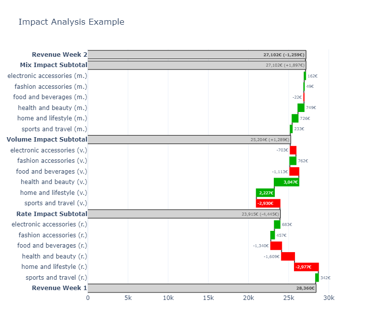

# l4v1

l4v1 is a Python library designed to simplify some data-analytics tasks using data manipulation and visualization techniques. Built on top of Polars and Plotly, it offers a straightforward API for creating detailed summaries in a quick way. It is work in progress and more functionality is to be added in future.

## Installation

You can install the l4v1 package directly from PyPI:

```bash
pip install l4v1
```
## Usage

### Impact Analysis
#### Impact Table
The impact_table function allows you to perform comparative analysis between two datasets—your primary dataset and a comparison dataset. This function is versatile, suitable for various analyses including period-to-period comparisons, budget vs. actual evaluations, or any scenario where understanding the drivers of change in an outcome metric (like revenue, orders, or any quantifiable metric) is crucial.

By specifying group dimensions, a volume metric (e.g., sales units or website visits), and an outcome metric (e.g., revenue, orders), you can dissect the contributing factors to performance variations. This tool is invaluable for identifying why certain metrics have increased or decreased compared to another period or benchmark.

Here's an example of how to use impact_table to compare week-to-week sales data, focusing on differences across product categories:

```python
import polars as pl
from l4v1 import impact_table

# Load your datasets
sales_week1 = pl.read_csv("data/sales_week1.csv")
sales_week2 = pl.read_csv("data/sales_week2.csv")

# Perform the impact analysis
impact_df = impact_table(
    df_primary=sales_week2,
    df_comparison=sales_week1,
    group_by_columns=["product_category"],
    volume_metric_name="item_quantity",
    outcome_metric_name="revenue"
)

```
#### Impact Plot
After generating an impact table, you can visualize the results with impact_plot. This function creates a waterfall plot that highlights how different groups contributed to the overall change in outcomes:
```python
from l4v1 import impact_plot

# Visualize the impact analysis
fig = impact_plot(
    impact_table=impact_df,
    format_data_labels="{:,.0f}€", # Optional
    primary_total_label="revenue week 2", # Optional
    comparison_total_label="Revenue Week 1", # Optional
    title="Impact Analysis Example", # Optional title
    color_total="lightgray", # Optional for total colors
    color_increase="#00AF00", # Optional for increase color
    color_decrease="#FF0000" # Optional for decrease color
)
fig.show()
```
This will generate a waterfall plot that illustrates how different product categories impacted in less sales in the week 2.



#### Interpreting the Results
The impact plot visualizes three types of impacts:

* Rate Impact: Changes in the average rate value within each category (e.g., average unit price).
* Volume Impact: Changes in volume (e.g., quantities sold).
* Mix Impact: Effects due to the shift in proportions among categories (e.g., if a higher proportion of sales comes from high-value items).

### Features
Data Grouping: Group your data based on one or more columns.
Impact Calculation: Automatically calculate volume, outcome, and rate impacts between two datasets.
Visual Representation: Create waterfall plots to visually represent the impact analysis results.
